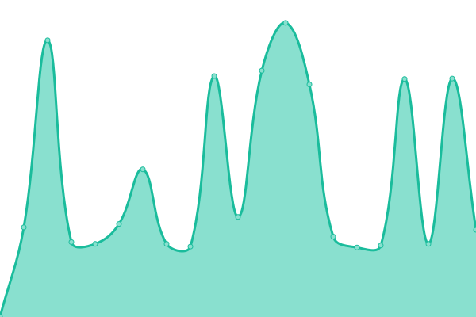

# [📈 Live Status](https://monitor.billie.digital): <!--live status--> **🟥 Complete outage**

This repository contains the open-source uptime monitor and status page for [Santhosh Thomas ](santhoshthomas.xyz), powered by [Upptime](https://github.com/upptime/upptime).

With [Upptime](https://upptime.js.org), you can get your own unlimited and free uptime monitor and status page, powered entirely by a GitHub repository. We use [Issues](https://github.com/sats268842/billie/issues) as incident reports, [Actions](https://github.com/sats268842/billie/actions) as uptime monitors, and [Pages](https://monitor.billie.digital) for the status page.

<!--start: status pages-->
<!-- This summary is generated by Upptime (https://github.com/upptime/upptime) -->
<!-- Do not edit this manually, your changes will be overwritten -->
<!-- prettier-ignore -->
| URL | Status | History | Response Time | Uptime |
| --- | ------ | ------- | ------------- | ------ |
|  [Billie-Production](https://billie.digital) | 🟥 Down | [billie-production.yml](https://github.com/sats268842/billie/commits/HEAD/history/billie-production.yml) | 

 584ms
     
 | 

<a href="https://monitor.billie.digital/history/billie-production">98.05%</a>
    

|  [Billie-Staging](https://staging.billie.digital) | 🟥 Down | [billie-staging.yml](https://github.com/sats268842/billie/commits/HEAD/history/billie-staging.yml) | 

 1197ms
     
 | 

<a href="https://monitor.billie.digital/history/billie-staging">99.40%</a>
    

|  [Billie-API-Staging](https://api2-staging.billie.digital) | 🟥 Down | [billie-api-staging.yml](https://github.com/sats268842/billie/commits/HEAD/history/billie-api-staging.yml) | 

 507ms
     
 | 

<a href="https://monitor.billie.digital/history/billie-api-staging">98.05%</a>
    

|  [Billie-API-Production](https://api2.billie.digital) | 🟥 Down | [billie-api-production.yml](https://github.com/sats268842/billie/commits/HEAD/history/billie-api-production.yml) | 

 481ms
     
 | 

<a href="https://monitor.billie.digital/history/billie-api-production">98.05%</a>
    

|  [Billie-PDF-GENERATOR-API-Production](https://api.billie.digital) | 🟥 Down | [billie-pdf-generator-api-production.yml](https://github.com/sats268842/billie/commits/HEAD/history/billie-pdf-generator-api-production.yml) | 

 672ms
     
 | 

<a href="https://monitor.billie.digital/history/billie-pdf-generator-api-production">0.00%</a>
    

<!--end: status pages-->

[**Visit our status website →**](https://monitor.billie.digital)

## 📄 License

- Powered by: [Upptime](https://github.com/upptime/upptime)
- Code: [MIT](./LICENSE) © [Santhosh Thomas ](santhoshthomas.xyz)
- Data in the `./history` directory: [Open Database License](https://opendatacommons.org/licenses/odbl/1-0/)
